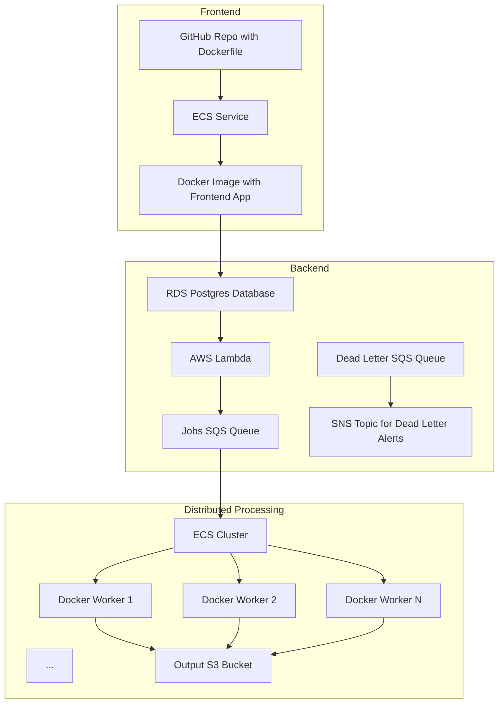

# Pinecone AWS Reference Architecture with Pulumi

## Overview

This repo is the initial scratch repo for figuring out how to work with Pulumi and define the AWS archtitecture required to get Roie's 
object search through video application stood up and working in a Production-ready manner. 

## Proposed architecture 

## Getting started: 

### Step 1. Install Pulumi 

Follow their [setup instructions here](https://www.pulumi.com/docs/install/)

### Step 2. Get AWS access credentials

You can either create your own AWS test account with a billing method you control and eventually expense back the charges, or you may 
be able to obtain access to an AWS account already under Pinecone control.

**DO NOT USE YOUR ROOT USER ACCOUNT FOR SCREWING AROUND WITH PULUMI OR ANYTHING ELSE**

Create an IAM user, ideally named `pulumi`, and check the box to grant this IAM user AWS console permissions, and download the CSV file with the IAM user's credentials 
when prompted. Alternatively, save the IAM user's login information in a password manager like BitWarden.

You can directly attach the `Administrator` permission to your IAM user if you're running this for development purposes in your own AWS account.

## Step 3. Save your AWS credentials securely 

In addition to securely saving your IAM user's login information, you also need to securely store your IAM user's AWS Key ID and AWS secret key values 
(these are the security credentials you create on the IAM user's page after signing back into the console as the IAM user).

I recommend putting them in a password manager like BitWarden or a secure (encrypted) note service. 

## Step 4. Configure AWS credentials file

Normally I'd recommend against doing this (because it keeps your secrets stored in plaintext in your home drive), but it seems to work 
best with the pulumi CLI so far. If you're concerned with security and best practices, recommend setting up and learning to use [aws-vault](https://github.com/99designs/aws-vault)

Follow the [instructions on this page](https://www.pulumi.com/registry/packages/aws/installation-configuration/) to add your credentials
to your `~/.aws/credentials` file - the most straightforward way to do this is via the `aws` CLI which you can install via homebrew if you 
don't already have it.

Run the `aws configure` command as demonstrated in the above instructions. After entering your Key ID and secret key, open `~/.aws/credentials`
and ensure that your profile was created correctly with the key ID and secret key values. If this is your first AWS profile managed via the 
credentials file, you will notice it is named `[default]`. I recommend changing this to `pulumi` and saving the file. This will make it easier
to understand what is happening when you next look at this file 7 months from now. 

Next, tell the pulumi toolchain to use this AWS profile going forward: 

`pulumi config set aws:profile pulumi`

Test that you can run the `index.ts` pulumi configuration by running `pulumi up` with no other flags - as this will attempt to use the AWS 
credentials you have set in your credentials file and configured the `pulumi` CLI to use when making API calls to AWS.

## Running pulumi 

If your AWS account credentials are configured correctly as above, you should only need to run `pulumi up` which is similar to a `terraform plan`
followed by a `terraform apply` if you accept the plan. 

Pulumi will first show you what infrastructure changes it plans to make based on the TypeScript code writen in `index.ts` and the current state of
the resources in your AWS account. If you select the `yes` option from the dropdown in your terminal, Pulumi will attempt to make the AWS API calls
necessary to make the changes in your AWS account.

## Plan 

Once we've figured out Roie's use case and have the infrastructure working properly, we'll generalize this into a generic starting point 
that anyone can use to deploy their own Production-ready high-scale distributed system for creating embeddings and upserting them to Pinecone.

## Docker instructions: frontend app

Run the `./build-docker.sh` script in the [`semantic-search-postgres` repository](https://github.com/pinecone-io/semantic-search-postgres). 

This script will detect any missing environment variables you still need to set by exporting them in your shell like so: 

`export PINECONE_API_KEY=<your-api-key>`

Once all required environment variables are set, the script will perform the docker build, passing the secrets via build args into the docker build.

When the build completes, you'll have the frontend image built locally on your machine. You now need to get this image into the AWS ECR registry. 

First, log into the registry via the `aws` CLI to retrieve an authentication token you can use for your subsequent Docker commands: 

For example:

`aws ecr get-login-password --region us-east-1 | docker login --username AWS --password-stdin 675304494746.dkr.ecr.us-east-1.amazonaws.com`

If you defined your aws credentials via the `~/.aws/credentials` file, you will need to pass the `--profile` flag like so: 

`aws --profile pulumi ecr get-login-password --region us-east-1 | docker login --username AWS --password-stdin 675304494746.dkr.ecr.us-east-1.amazonaws.com`

If this command succeeds you'll get `Login succeeded!` in your terminal, meaning that subsequent Docker commands in your shell will use this authentication token 
when communicating with the ECR registry.

You then need to tag your local image that you just built via the `build-docker.sh` script as destined for the ECR registry, like so: 

`docker tag semantic-app:latest 675304494746.dkr.ecr.us-east-1.amazonaws.com/frontend-c97ebf7:latest`

Note that the ECR registry ID and aws region forming the the ECR tag will be specific to your AWS account. 

You can now push your image via the full ECR tag like so: 

`docker push 675304494746.dkr.ecr.us-east-1.amazonaws.com/frontend-c97ebf7:latest`

You should see output referring to pushing Docker image layers to AWS ECR.

You can log into the UI or aws the `aws` command line to ensure the image was successfully pushed. 

## Roie’s Wishlist

This is what we currently believe we're going to need to get Roie's video frame processing demo working end to end on AWS at scale:

- N instances (workers)
    - Embedding and upserting
    - Workers run docker and pull images (possibly, there are tons of ways to do this)
- ECR container registry
    - Push images here
- SQS or kinesis
    - Dead letter queue for failure
- SNS
    - Monitoring and alerts
    - Dead letter queue notifications to an email address most likely
- S3
    - Input bucket (storing frames)

