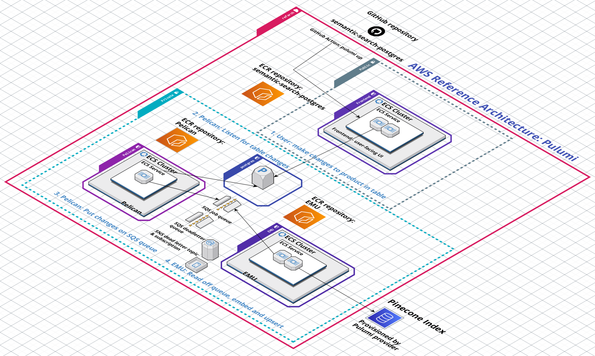

# Architecture Overview 

The Pinecone AWS Reference Architecture, implemented using Pulumi, is a comprehensive cloud solution designed to orchestrate, deploy, and manage various components within the AWS ecosystem efficiently. The architecture leverages AWS services and Pulumi's Infrastructure as Code (IaC) capabilities to create a robust and scalable environment.
Core Components

1. **Networking with VPC**: Utilizes AWS's Virtual Private Cloud (VPC) to provision a secure, isolated section of the AWS cloud where AWS resources can be launched in a defined virtual network.

1. **Elastic Container Registry (ECR) Repositories**: Three ECR repositories are created for distinct purposes:
    * Frontend Repository: For the semantic-search-postgres application.
    * Pelican Microservice Repository: Listens for changes from the Postgres database.
    * Emu Microservice Repository: Manages embeddings and upserts into the Pinecone index.

1. **Backend - RDS Postgres Database**: An RDS instance is configured to store product information and natural language descriptions. It includes triggers for notifying the Pelican microservice of any changes.

1. **Security and Networking:** Security Groups: Multiple security groups are defined for different components like the load balancer, frontend service, RDS database, and microservices, ensuring a layered security approach.
    * Load Balancer (ALB): An Application Load Balancer is configured to distribute incoming application traffic across multiple targets in the public subnet.

1. **Microservices and ECS**:
    * ECS Clusters: Separate clusters are set up for frontend UI, Pelican, and Emu microservices, managed by AWS ECS.
    * Fargate Services: AWS Fargate is used to run the containers without managing servers or clusters.
    * Auto-Scaling: Auto-scaling is configured for the Emu and Pelican services, adjusting the desired count of tasks based on CPU utilization.

1. **Docker Image Builds:**
    * Frontend Image: Hosts the user-facing UI, allowing interactions with product data.
    * Pelican Microservice: Monitors the Postgres database for changes and queues messages for processing.
    * Emu Microservice: Handles the transformation of data into embeddings and updates the Pinecone index.

1. **Messaging and Notifications:**
    * SQS Queues: Amazon Simple Queue Service (SQS) is used for message queuing, with a dead-letter queue configured for unprocessed messages.
    * SNS Topics: Amazon Simple Notification Service (SNS) is utilized for dead letter notifications.

1. **Environment Configuration:**
    * Environment Variables: Essential environment variables like `PINECONE_API_KEY`, `AWS_REGION`, and database credentials are managed to facilitate the connectivity and security of services.

1. **Deployment and Management with Pulumi:**
    * Infrastructure as Code: The entire infrastructure, from network configuration to service deployment, is defined and managed through Pulumi code, providing a repeatable and version-controlled deployment process.
    * Exports and Outputs: Key information such as service URLs, database addresses, and queue IDs are exported for easy access and reference.

## Apps

The Pinecone AWS Reference Architecture is comprised of three applications (one frontend UI app and two microservices) as well as the Pinecone index 
and the AWS infrastructure to support these: 

- `semantic-search-postgres` (user-facing UI application which enables semantic search over a table of products)
- `pelican` (microservice that listens to the RDS Postgres instance for changes and puts changes on the SQS jobs queue)
- `emu` (microservice that takes jobs off the SQS queue and embeds and upserts their contents into the Pinecone index)

Each application has its own Dockerfile and README. Each README includes instructions on manually building the Docker image for that app in case 
you wish to debug or explore the application locally.

## Docker images 

When you run `pulumi up`, Pulumi takes care of programmatically building the Docker images for each app and pushing them to their respective ECR container repository. 

Pulumi handles authentication under the hood, so you do not need to manually authenticate to ECR repositories to push the Docker images.
