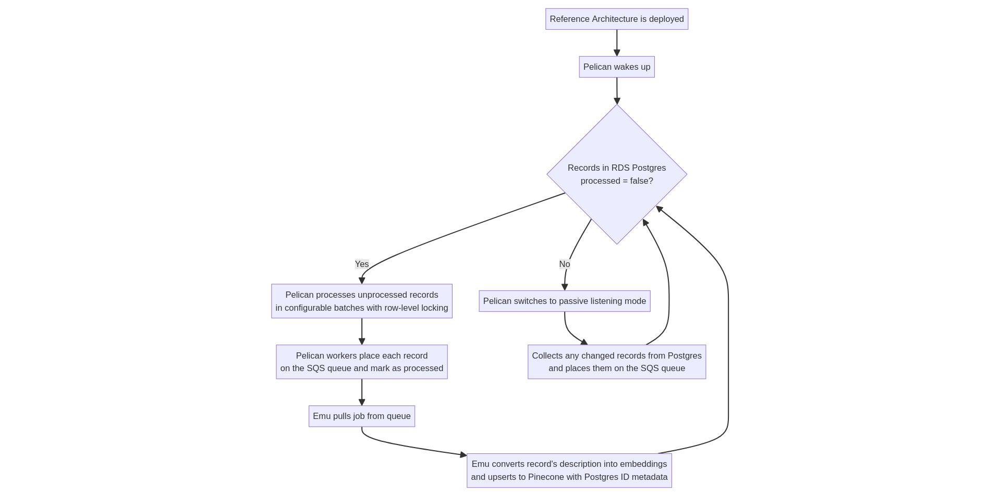

# Core concepts 

This document explains core concepts and functionality within the Pinecone AWS Reference Architecture.

# Table of contents 
* [Initial data bootstrapping flow](#initial-data-bootstrapping-flow)
* [Autoscaling](#autoscaling)

## Initial data bootstrapping flow

The initial data bootstrapping phase is a crucial component of the Reference Architecture. 

This phase ensures that the Pinecone index is always in sync with the contents of the RDS Postgres database. 

By maintaining this synchronization, Pinecone can effectively serve as the semantic search backend, enabling end-users to issue natural language queries that are accurately mapped to the structured data within RDS Postgres.

### Bootstrapping process

1. **Deployment of Reference Architecture**: The process begins once the Reference Architecture is deployed. This setup includes all the necessary components, such as the RDS Postgres database and the Pinecone service.

1. **Activation of Pelican**: Upon deployment, the Pelican service starts and checks the RDS Postgres database for records marked as processed = false. These unprocessed records are the primary focus of the initial bootstrapping.

1. **Batch Processing by Pelican**: Pelican identifies all unprocessed records and processes them in configurable batches. To ensure efficiency and prevent conflicts, row-level locking is employed. This mechanism allows multiple Pelican workers to operate simultaneously without interfering with each other.

1. **Queueing and Processing Records**: Each record in a batch is placed on the SQS queue by Pelican workers. After placing a record on the queue, the worker marks it as processed in the Postgres database.

1. **Handling by Emu**: The Emu service continuously pulls jobs off the SQS queue. For each record, Emu converts the record's description into embeddings and upserts these into the Pinecone index. Crucially, Emu attaches metadata linking each vector back to its original Postgres record, including the Postgres ID, ensuring traceability and synchronization.

1. **Transition to Passive Listening**: Once all existing records are processed, Pelican shifts to a passive listening mode. In this mode, Pelican monitors the RDS Postgres database for any new or changed records. These records are then placed on the SQS queue, maintaining ongoing synchronization between Postgres and Pinecone.

### Importance of synchronization

The synchronization between the RDS Postgres database and the Pinecone index is vital for the Reference Architecture's core functionality. 

It allows the architecture to support ambiguous natural language queries from users, translating them into structured queries that interact with the data 
in RDS Postgres. 

This synchronization ensures that users can retrieve accurate and relevant results from their searches, enhancing the overall utility and user experience of the system.

## Autoscaling 

The Pinecone AWS Reference Architecture defines autoscaling policies for Pelican and Emu, the two microservices that write to, and read from, the shared SQS queue respectively. 

Pelican is the microservice that reads records out of Postgres and writes them to the SQS queue. It has an attached autoscaling policy configured to keep the Pelican ECS service's 
average CPU at a certain amount. There are also minimum and maximum counts defined for Pelican workers on the policy. 

Emu is the microservice that reads changed Postgres records off the shared SQS queue and converts their description fields to embeddings, then upserts the vectors to Pinecone, attaching metadata
that associates the vector with the original Postgres record (by storing its Postgres ID). It also has an attached autoscaling policy configured to keep the Emu ECS service's 
average CPU at a certain amount. There are also minimum and maximum counts defined for Emu workers on the policy. 

Generally speaking, you will need less Pelican workers than Emu workers, because Pelican's task of reading messages out of Postgres and writing them to the SQS queue is less resource intensive than 
Emu's task of converting the natural language descriptions of products into embeddings and upserting them via the Pinecone API. 

Pelican also supports an environment variable, `BATCH_SIZE` which determines the number of Postgres records each Pelican worker will `select` when it is retrieving a segment of records to loop through 
and place on the queue. Once the full Reference Architecture is successfully deployed, you can modify this variable and then run `pulumi up` in order to modify the value. The default value is `1000` records
per batch if no `BATCH_SIZE` environment variable is set.

### Triggers - high and low watermarks

The autoscaling policies for Pelican and Emu are defined at the bottom of the `index.ts` file. Though their criteria and thresholds are set differently, each autoscaling policy works in the same way: 

1. When the condition for the average CPU utilization is breached - the associated CloudWatch Alarm enters the `alarm` state. You can view the CloudWatch dashboard and view the alarms themselves. 
1. The converse "scale-in" activity for the autoscaling policy won't be triggered until enough datapoints are received that show the inverse condition has been reached. Typically, this is 15 data 
points received over the course of 15 minutes.

In other words, you'll typically notice that Pelican and Emu are relatively quick to scale-out and add more workers, but are more conservative about "scaling-in" to a lesser number of workers. 

